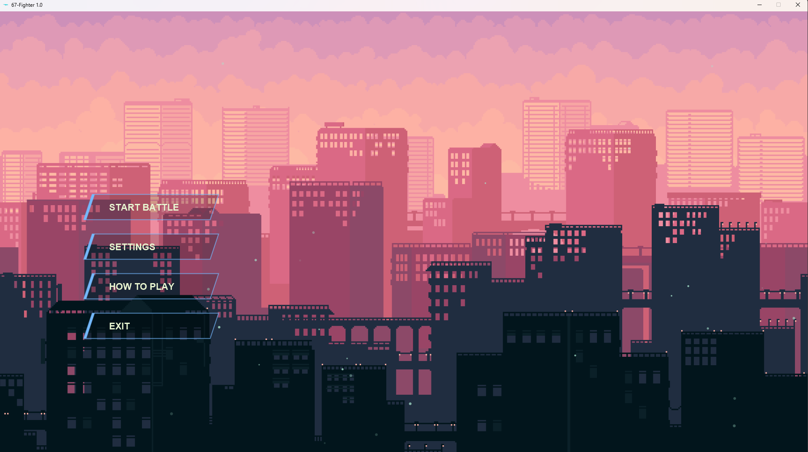
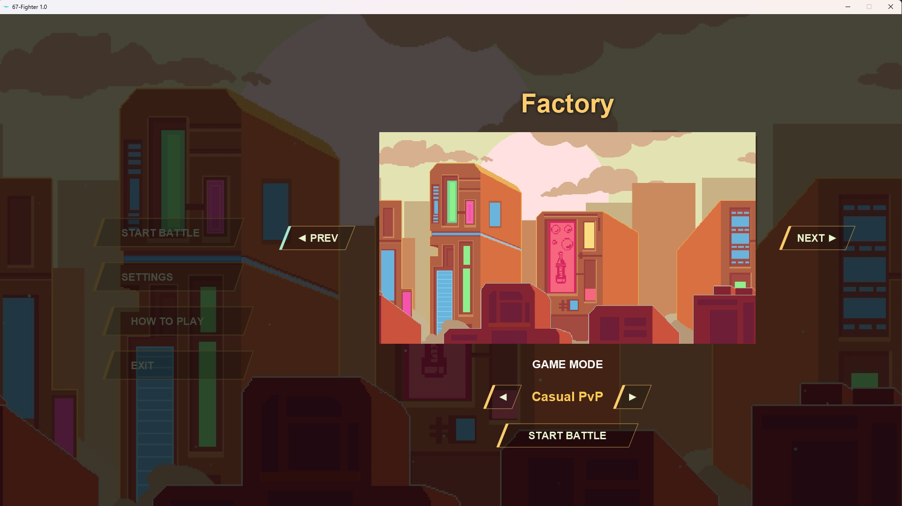
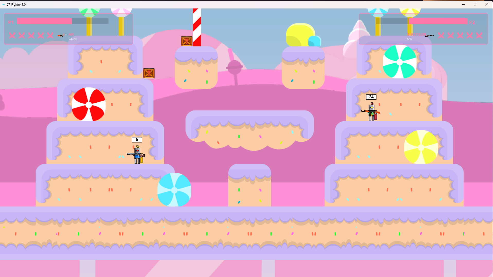
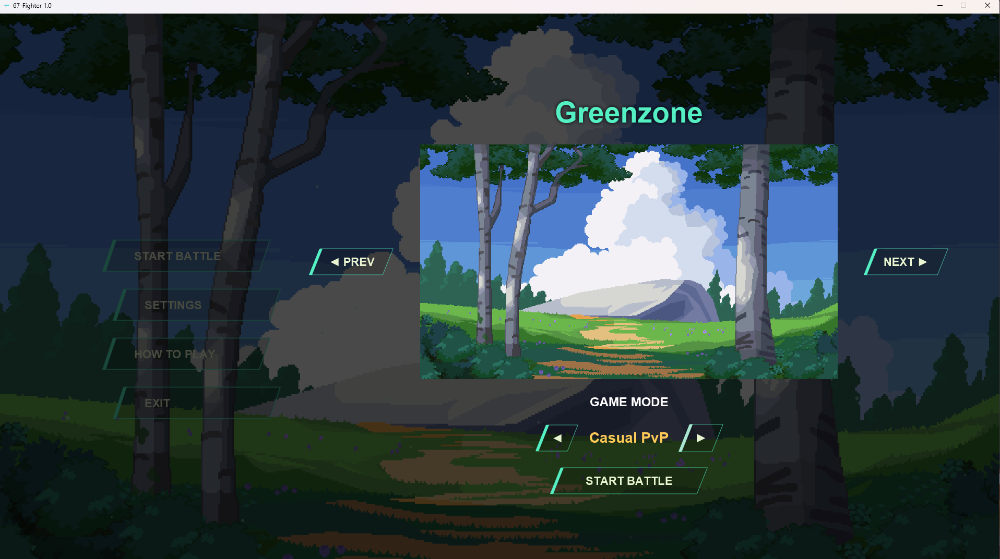

<div align="center">

<h1 id="title">🥊 67-Fighter</h1>

<div id="languageToggle" style="text-align: center; margin: 10px 0;">
  <button id="langBtn" style="padding: 8px 16px; border: 2px solid #74b9ff; border-radius: 5px; background: #74b9ff; color: white; cursor: pointer; font-weight: bold; transition: all 0.3s;">
    English / Tiếng Việt
  </button>
</div>

---

<!-- VIETNAMESE VERSION -->
<div id="vi-content">

> **Game đấu trường platformer** dành cho 2 người chơi (hoặc 1 người vs Bot), được xây dựng bằng **Java + JavaFX + FXGL**.

---

## 📸 Ảnh chụp màn hình

| Menu Chính | Chọn Bản đồ – Factory |
|:---------:|:--------------------:|
|  |  |

| Gameplay – Sweetday | Chọn Bản đồ – Greenzone |
|:-------------------:|:----------------------:|
|  |  |

---

## 📖 Giới thiệu

**67-Fighter** là một game đấu trường dạng platformer 2D. Hai nhân vật chiến đấu trên các màn chơi khác nhau bằng cách bắn đạn, nhặt vũ khí từ thùng đạn.

Dự án được thực hiện bởi **Nhóm 67**.

---

## ✨ Tính năng

### 🎮 Gameplay
- **2 chế độ chơi:**
  - `Casual PvP` — 2 người chơi trên cùng bàn phím
  - `Hard Bot Mode` — 1 người chơi đối đầu với AI
- **Hệ thống máu & mạng:** Mỗi người có 100 HP và 5 mạng. Chết hết mạng là thua.
- **Hệ thống vũ khí** phong phú — nhặt từ thùng crate rải ngẫu nhiên trên bản đồ:

| Vũ khí | Đạn | Tốc độ bắn | Đặc điểm |
|--------|------|-----------|----------|
| 🔫 Pistol | 7 | 0.3s | Vũ khí mặc định, tự reload |
| 🪃 Shotgun | 6 | 1.0s | Sát thương cao, bắn nhiều viên |
| 🎯 Rifle (AWM) | 5 | 2.0s | Tốc độ đạn cực nhanh, sát thương cao |
| ⚡ Uzi | 40 | 0.05s | Tốc độ bắn cực nhanh |
| 💥 AK | 30 | 0.1s | Cân bằng giữa sát thương và tốc độ bắn |

- **Cơ chế di chuyển nâng cao:**
  - Double jump (nhảy 2 lần)
  - Dash (bấm đúp hướng để lao nhanh)
  - Xuyên sàn mềm (one-way platform)
  - Fast fall (rơi nhanh xuống sàn phía dưới)
  - Hitstun khi trúng đạn

### 🗺️ Bản đồ
Có **5 bản đồ** với nhạc nền và màu sắc chủ đề riêng:

| Tên | Theme màu | Nhạc |
|-----|-----------|------|
| 🌃 City of Lights | Sky Blue `#74b9ff` | menu_track_03 |
| 🌿 Greenzone | Emerald `#55efc4` | menu_track_04 |
| 🏭 Factory | Amber `#fdcb6e` | menu_track_05 |
| 🍭 Sweetday | Pink `#fd79a8` | menu_track_06 |
| 🌋 Volcano Valley | Red-Orange `#ff7675` | menu_track_07 |

### 🤖 AI Bot
- Máy tự đánh theo **state machine** với 4 trạng thái:
  - `APPROACH` — tiến lại gần khi quá xa
  - `HOLD` — giữ khoảng cách lý tưởng và bắn
  - `RETREAT` — lui lại khi quá gần
  - `GRAB_CRATE` — nhặt thùng đạn gần nhất
- Bot biết nhảy, nhảy đôi, tụt sàn, và chỉ bắn khi ngang hàng với mục tiêu.

### 🎨 UI & Visual
- Main menu với **slideshow background** tự động đổi theo từng bản đồ
- Màu accent của button và tiêu đề đổi theo theme bản đồ đang hiển thị
- Hiệu ứng hover, animation slide-in, breathing title
- HUD hiển thị HP bar, số mạng, vũ khí hiện tại và số đạn
- Camera theo dõi cả 2 người chơi, tự zoom ra/in tùy khoảng cách

---

## 🕹️ Điều khiển

### Người chơi 1 (WASD)
| Phím | Hành động |
|------|-----------|
| `A` | Di chuyển trái |
| `D` | Di chuyển phải |
| `W` | Nhảy (bấm 2 lần = nhảy đôi) |
| `S` | Tụt xuống sàn phía dưới |
| `F` | Bắn |
| `A` + `A` (bấm đúp) | Dash trái |
| `D` + `D` (bấm đúp) | Dash phải |

### Người chơi 2 (Arrow Keys)
| Phím | Hành động |
|------|-----------|
| `←` | Di chuyển trái |
| `→` | Di chuyển phải |
| `↑` | Nhảy (bấm 2 lần = nhảy đôi) |
| `↓` | Tụt xuống sàn phía dưới |
| `L` | Bắn |
| `←` + `←` (bấm đúp) | Dash trái |
| `→` + `→` (bấm đúp) | Dash phải |

---

## 🏗️ Công nghệ sử dụng

| Thành phần | Công nghệ |
|-----------|-----------|
| Ngôn ngữ | Java 21 |
| UI Framework | JavaFX 21.0.2 |
| Game Engine | [FXGL 21](https://github.com/AlmasB/FXGL) |
| Build Tool | Apache Maven |
| Map Format | Tiled (.tmx) |
| Physics | Box2D (qua FXGL) |

---

## 🚀 Hướng dẫn chạy game

### Yêu cầu
- **JDK 21** trở lên
- **Maven 3.8+**

### Chạy bằng Maven
```bash
# Clone repo
git clone https://github.com/mrmommo/fighter67.git
cd fighter67

# Chạy game
mvn javafx:run
```

### Build ra file JAR
```bash
mvn package
java -jar target/fighter67-1.0-SNAPSHOT.jar
```

---

## 📁 Cấu trúc dự án

```
fighter67/
├── src/main/java/com/nhom67/platformfighter/
│   ├── app/                    # Entry point (FighterApp, AppSceneFactory)
│   ├── ai/                     # Logic AI Bot
│   ├── controllers/            # Input & collision handlers
│   │   ├── input/              # Key bindings cho P1 & P2
│   │   └── collisions/         # Xử lý va chạm vật lý
│   ├── core/                   # GameMode, RoundManager, CameraController
│   ├── entity/                 # EntityFactory, EntityType
│   │   └── component/          # PlayerComponent, WeaponData, BulletComponent...
│   ├── map/                    # MapLoader, MapRegistry
│   ├── scene/                  # Menu, Select, GameOver scenes & controllers
│   └── util/                   # SoundManager
└── src/main/resources/assets/
    ├── levels/                 # Tiled map files (.tmx)
    ├── textures/               # Sprites, background images
    ├── guns/                   # Hình ảnh vũ khí
    ├── bullet/                 # Hiệu ứng đạn
    ├── music/                  # Nhạc nền các map
    ├── sounds/                 # Âm thanh súng, click...
    └── ui/                     # FXML layouts + CSS
```

---

## 👥 Nhóm phát triển

Dự án được thực hiện bởi **Nhóm 67** trong môn học lập trình hướng đối tượng.

</div>

<!-- ENGLISH VERSION -->
<div id="en-content" style="display: none;">

> **Platform Fighter game** for 2 players (or 1 player vs Bot), built with **Java + JavaFX + FXGL**.

---

## 📸 Screenshots

| Main Menu | Map Select – Factory |
|:---------:|:--------------------:|
|  |  |

| Gameplay – Sweetday | Map Select – Greenzone |
|:-------------------:|:----------------------:|
|  |  |

---

## 📖 Introduction

**67-Fighter** is a 2D platformer-style fighting game. Two characters battle on different maps by shooting bullets and picking up weapons from ammo crates scattered across the arena.

The project was developed by **Group 67**.

---

## ✨ Features

### 🎮 Gameplay
- **2 Game Modes:**
  - `Casual PvP` — 2 players on the same keyboard
  - `Hard Bot Mode` — 1 player against AI opponent
- **Health & Lives System:** Each player has 100 HP and 5 lives. Losing all lives means defeat.
- **Rich Weapon System** — Collect from crates randomly placed on the map:

| Weapon | Ammo | Fire Rate | Characteristics |
|--------|------|-----------|----------|
| 🔫 Pistol | 7 | 0.3s | Default weapon, auto-reloads |
| 🪃 Shotgun | 6 | 1.0s | High damage, fires multiple bullets |
| 🎯 Rifle (AWM) | 5 | 2.0s | Extremely fast bullet speed, high damage |
| ⚡ Uzi | 40 | 0.05s | Extremely fast fire rate |
| 💥 AK | 30 | 0.1s | Balanced damage and fire rate |

- **Advanced Movement Mechanics:**
  - Double jump
  - Dash (double-tap direction to rush forward)
  - One-way platform penetration
  - Fast fall (accelerated fall through soft platforms)
  - Hitstun when hit by bullets

### 🗺️ Maps
**5 maps** with unique background music and color themes:

| Name | Color Theme | Music |
|-----|-----------|------|
| 🌃 City of Lights | Sky Blue `#74b9ff` | menu_track_03 |
| 🌿 Greenzone | Emerald `#55efc4` | menu_track_04 |
| 🏭 Factory | Amber `#fdcb6e` | menu_track_05 |
| 🍭 Sweetday | Pink `#fd79a8` | menu_track_06 |
| 🌋 Volcano Valley | Red-Orange `#ff7675` | menu_track_07 |

### 🤖 AI Bot
- AI opponent follows a **state machine** with 4 states:
  - `APPROACH` — Move closer when too far
  - `HOLD` — Maintain ideal distance and shoot
  - `RETREAT` — Back away when too close
  - `GRAB_CRATE` — Grab nearest ammo crate
- Bot can jump, double jump, fall through platforms, and only shoots when horizontally aligned with target.

### 🎨 UI & Visual
- Main menu with **automatic slideshow background** that changes per map
- Button and title accent colors change based on the displayed map theme
- Hover effects, slide-in animations, breathing title
- HUD displays HP bar, remaining lives, current weapon, and ammo count
- Camera tracks both players, auto-zooms in/out based on distance

---

## 🕹️ Controls

### Player 1 (WASD)
| Key | Action |
|------|-----------|
| `A` | Move left |
| `D` | Move right |
| `W` | Jump (press twice = double jump) |
| `S` | Fall through platform below |
| `F` | Shoot |
| `A` + `A` (double-tap) | Dash left |
| `D` + `D` (double-tap) | Dash right |

### Player 2 (Arrow Keys)
| Key | Action |
|------|-----------|
| `←` | Move left |
| `→` | Move right |
| `↑` | Jump (press twice = double jump) |
| `↓` | Fall through platform below |
| `L` | Shoot |
| `←` + `←` (double-tap) | Dash left |
| `→` + `→` (double-tap) | Dash right |

---

## 🏗️ Technologies Used

| Component | Technology |
|-----------|-----------|
| Language | Java 21 |
| UI Framework | JavaFX 21.0.2 |
| Game Engine | [FXGL 21](https://github.com/AlmasB/FXGL) |
| Build Tool | Apache Maven |
| Map Format | Tiled (.tmx) |
| Physics | Box2D (via FXGL) |

---

## 🚀 How to Run the Game

### Requirements
- **JDK 21** or higher
- **Maven 3.8+**

### Run with Maven
```bash
# Clone repo
git clone https://github.com/mrmommo/fighter67.git
cd fighter67

# Run game
mvn javafx:run
```

### Build JAR file
```bash
mvn package
java -jar target/fighter67-1.0-SNAPSHOT.jar
```

---

## 📁 Project Structure

```
fighter67/
├── src/main/java/com/nhom67/platformfighter/
│   ├── app/                    # Entry point (FighterApp, AppSceneFactory)
│   ├── ai/                     # AI Bot logic
│   ├── controllers/            # Input & collision handlers
│   │   ├── input/              # Key bindings for P1 & P2
│   │   └── collisions/         # Physics collision handling
│   ├── core/                   # GameMode, RoundManager, CameraController
│   ├── entity/                 # EntityFactory, EntityType
│   │   └── component/          # PlayerComponent, WeaponData, BulletComponent...
│   ├── map/                    # MapLoader, MapRegistry
│   ├── scene/                  # Menu, Select, GameOver scenes & controllers
│   └── util/                   # SoundManager
└── src/main/resources/assets/
    ├── levels/                 # Tiled map files (.tmx)
    ├── textures/               # Sprites, background images
    ├── guns/                   # Weapon images
    ├── bullet/                 # Bullet effects
    ├── music/                  # Map background music
    ├── sounds/                 # Gun sounds, click sounds...
    └── ui/                     # FXML layouts + CSS
```

---

## 👥 Development Team

The project was developed by **Group 67** for an Object-Oriented Programming course.

</div>

---

<script>
// Language toggle script
document.getElementById('langBtn').addEventListener('click', function() {
  const viContent = document.getElementById('vi-content');
  const enContent = document.getElementById('en-content');
  const btn = document.getElementById('langBtn');
  
  if (viContent.style.display === 'none') {
    // Show Vietnamese
    viContent.style.display = 'block';
    enContent.style.display = 'none';
    btn.textContent = 'English / Tiếng Việt';
  } else {
    // Show English
    viContent.style.display = 'none';
    enContent.style.display = 'block';
    btn.textContent = 'Vietnamese / English';
  }
});
</script>

</div>